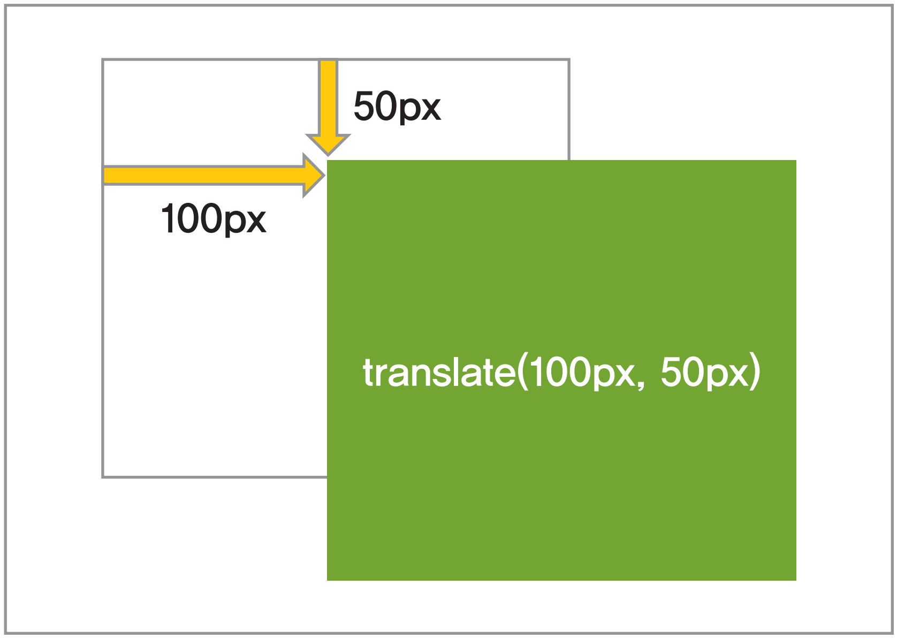
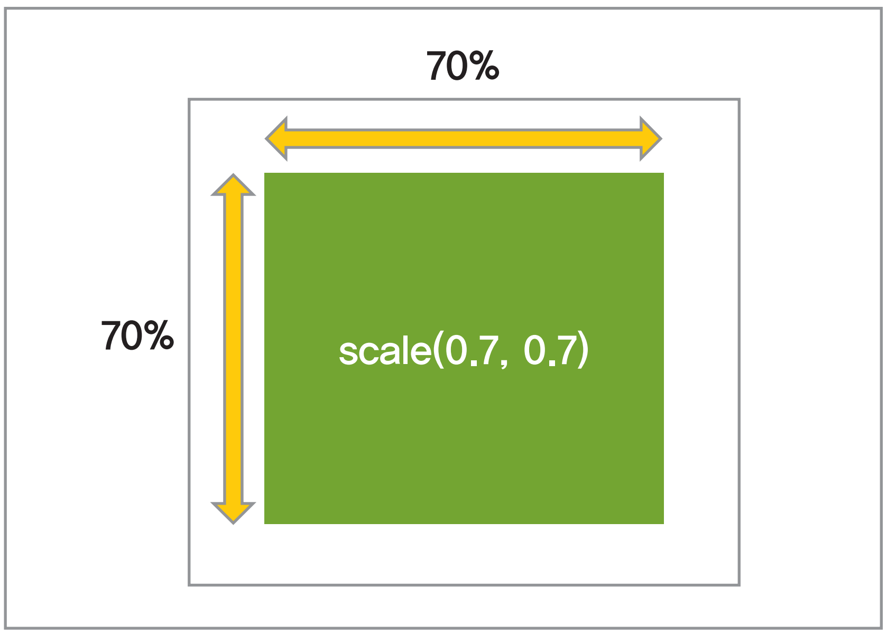
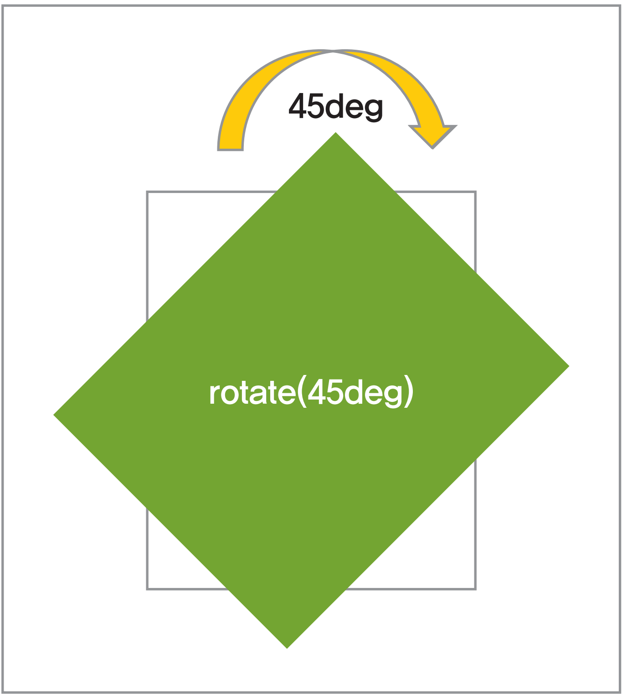
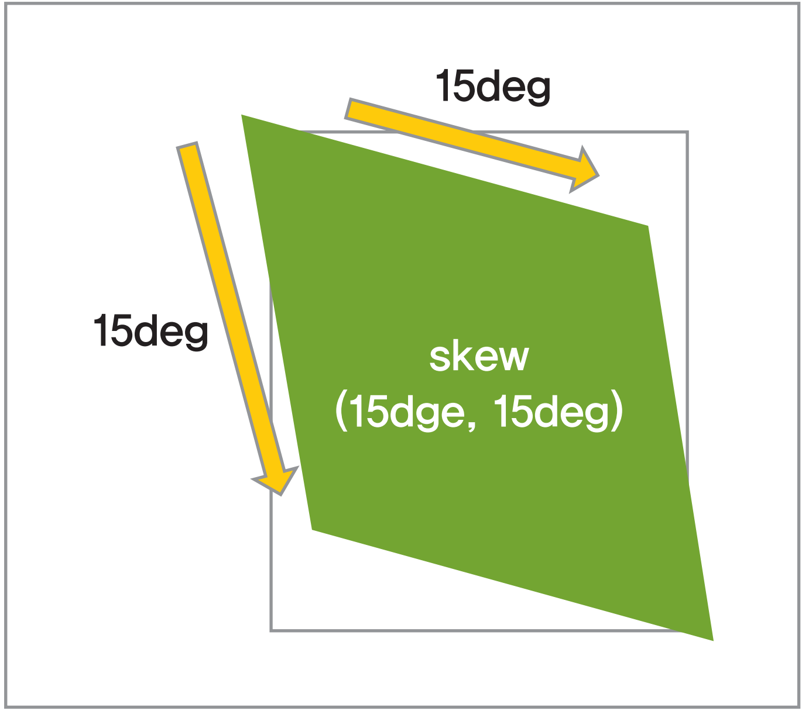
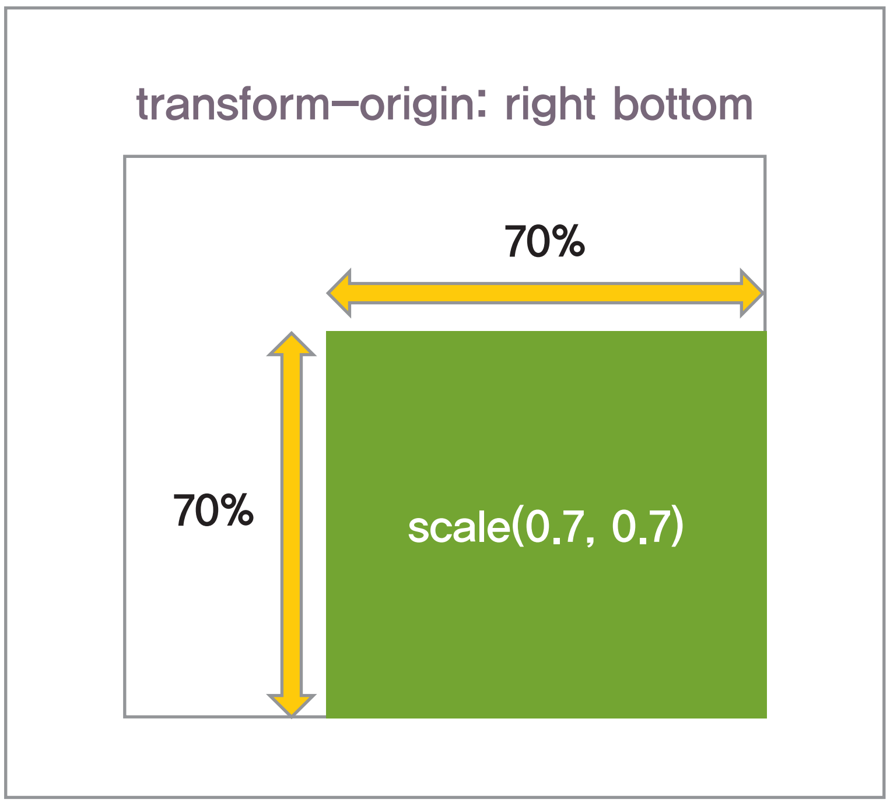
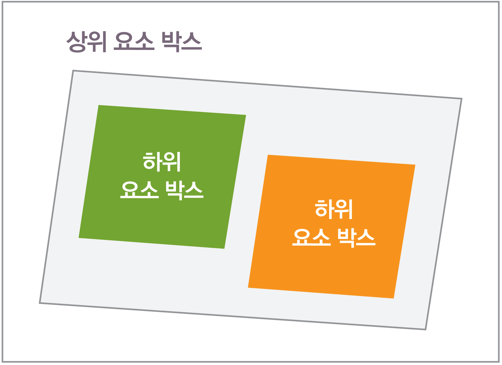

# Transform(변형)
CSS3의 가장 큰 변화 중 하나로 꼽을 수 있는 것이 바로 요소 박스를 변형하는 transform 관련 속성이라고 할 수 있습니다. transform 관련 속성을 사용하면 요소 박스의 크기 변형 및 회전, 기울임 등을 지정할 수 있습니다. 또한 평면상의 2차원 변형뿐만 아니라 3차원 변형도 가능합니다.

# Transform 속성
`transform`은 요소 박스를 변형하는 속성으로, 2차원 및 3차원 변형이 가능하며 변형 형태별로 함수 타입의 속성 값을 지정합니다. 이때 속성 값을 공란으로 구분하여 복수의 속성 값을 지정할 수 있습니다.

```css
translate(<translation-value>[, <translation-value>])
```

## Translate

`translate()` 함수는 HTML 요소 박스를 평면상에서 수평 이동하는 기능입니다. translation-value 값에는 요소가 변형 기준점으로부터 가로 및 세로 방향으로 이동하는 길이 값을 지정할 수 있습니다.

`translateX()`와 `translateY()` 함수로 이동거리를 방향별로 각각 지정할 수 있습니다. `translate()`로 이동된 요소는 다른 요소의 배치에 영향을 끼치지 않습니다.



```css
/* 예시 */
div { transform : translate(50px, 50px) ; }
div { transform : translateX(50px) ; }
div { transform : translateY(50px) ; }
```

## Scale

```css
scale(<number>[, <number>])
```

`scale()` 함수는 HTML 요소 박스의 크기를 변형하는 기능입니다. `translate()` 함수와 마찬가지로 X, Y 값을 지정하여 가로 및 세로 크기를 조절할 수 있습니다. 이때 지정 값은 단위를 가지지 않는 number 단위로, 이 값은 원래 요소 크기에 지정한 number 값을 곱한 크기로 적용됩니다.

`scaleX()`와 `scaleY()`로 각 축의 방향별 요소 크기를 지정할 수 있습니다. `scale()` 함수 역시 변경된 요소의 크기가 다른 요소 배치에 영향을 끼치지 않습니다.



```css
/* 예시 */
div { transform : scale(0.5, 0.5) ; }
div { transform : scaleX(0.5) ; }
div { transform : scaleY(0.5) ; }
```

## Rotate

```
rotate(<angle>)
```

`rotate()` 함수는 HTML 요소 박스를 평면상에서 회전하는 기능으로, 함수의 값으로 회전 각도(deg)를 지정할 수 있습니다. 이때 회전 각도가 양수 값일 경우에는 시계 방향으로 회전하고, 음수 값일 경우에는 반 시계 방향으로 회전합니다. `rotate()` 함수 역시 박스가 회전되어 요소의 표시 영역이 변경되더라도 다른 요소의 배치에는 영향을 끼치지 않습니다.



```css
/* 예시 */
div { transform : rotate(45deg) ; }
```

## Skew

```css
skew(<angle>[, <angle>])
```

`skew()` HTML 요소 박스의 기울임을 지정하는 기능입니다. `rotate()` 함수와 마찬가지로 함수 값에 기울기의 각도(deg)를 지정할 수 있으며, `skewX()`와 `skewY()`로 각 축 방향별 요소의 기울기를 지정할 수도 있습니다. 요소가 기울어져 변경되는 표시 영역은 다른 요소의 배치에 영향을 끼치지 않습니다.



```css
/* 예시 */
div { transform : skew(15deg, 15deg) ; }
div { transform : skewX(15deg) ; }
div { transform : skewY(15deg) ; }
```

## Matrix

```css
matrix(<number>, <number>,<number>,<number>,<number>,<number>)
```

`matrix() 함수는 HTML 요소 박스에 이동 및 회전 크기 변화와 기울임 등을 복합적으로 적용할 수 있는 기능입니다. 함수 값은 3×3 값의 행렬로, 앞서 살펴본 변형 관련 함수 값을 하나 혹은 둘 이상 조합하여 사용할 수 있는 기능입니다.

6개의 값은 순서대로 scaleX, skewX, skewY, scaleY, translateX, translateY입니다.


```css
/* 예시 */
div { transform : matrix(0.5, 0.2, 0.3, 0.5, 50, 100) ; }
```

# transform-origin 속성
transform-origin은 transform의 변형 기준점을 지정하는 속성입니다. 속성 값은 길이 단위 값과 키워드로 지정할 수 있으며, 배경 이미지의 위치를 지정하는 개념과 동일하게 사용합니다.

속성 값은 X, Y, Z축 방향으로 3개까지 입력할 수 있으며, 값이 1개 또는 2개일 경우에는 Z축 값이 0이 됩니다. 이때 값이 1개일 경우 X, Y축은 동일하게 적용되고 Z축 값은 0이 됩니다.



```css
/* 예시 */
div { transform-origin : right bottom ; }
div { transform-origin : 10% 20px ; }
div { transform-origin : 10px 20px 0 ; }
```

# transform-style 속성
transform-style은 3D 공간에서 변경된 3차원 좌표를 하위 요소에게 전달할 것인지의 여부를 결정하는 속성입니다. 속성 값 중에서 flat을 지정할 경우 하위 요소들은 모두 상위 요소의 3D 좌표와 상관없이 2D 영역에 표시되고, preserve-3d를 지정할 경우 부모 요소의 3D 좌표를 전달받아 3D 형태로 표현됩니다.



```css
/* 예시 */
div {
 transform-style : preserve-3d ;
 transform : rotateX(-15deg) rotateY(-30deg) ;
 background : rgba(0,0,0,0.2) ;
}
div p {
 background : rgba(255,0,0,0.5) ;
}
```

# perspective 속성
perspective는 3D 공간에서 요소와 관측 점과의 거리, 즉 원근감을 지정하는 속성입니다. perspective 속성으로 원근감 지정하는 것과 동일하게 transform 속성의 `perspective()` 함수로도 지정할 수 있습니다. 이때 속성 값이 작을수록 가깝게 보이고, 클수록 멀게 보입니다.


```css
/* 예시 */
div {
 position : relative ;
 perspective : 50px ;
}
div p {
 position : absolute ;
 background : #054D4A ;
 transform : rotateX(15deg) ;
}
```

# perspective–origin 속성
perspective-origin은 3D 공간상에서 원근감의 방향을 지정하는 속성으로, 요소의 좌측 상단을 기준으로 지정된 위치 값부터 원근감의 관측점이 적용됩니다. top이나 left의 경우 세로와 가로 방향 값을 0으로 지정된 것과 동일하며, right와 bottom은 세로와 가로 방향 값이 100%로 지정된 것과 동일합니다.

```css
/* 예시 */
div {
 position : relative ;
 perspective : 200px ;
 perspective-origin : 0 100% ;
}
div p{
 transform : rotateX(15deg) ;
}
```

# backface-visibility 속성
backface-visibility는 요소 박스가 뒤집혔을 경우 박스 뒷면의 표시 여부를 지정하는 속성으로, 이 속성을 사용하면 `rotateZ( )`나 `rotate3D( )` 사용하여 뒤집힌 요소 박스의 뒷면을 숨길 수 있습니다.


```css
/* 예시 */
div {
 position: absolute;
 background: rgba(5,77,74,1);
}
div p{
 background: rgba(255,100,0,0.8);
 transform: rotateY(180deg);
 backface-visibility: hidden;
}
```
